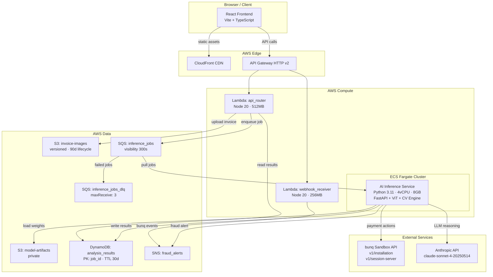
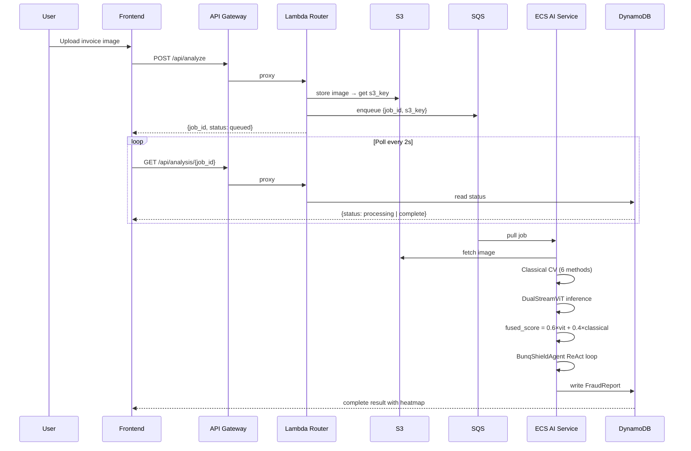

# BunqShield — Architecture

## Component Diagram

## AI Pipeline Flow

## Key Architectural Decisions

### ECS Fargate for AI (not Lambda)
ViT-Base/16 weights are ~700MB. Lambda has a 250MB package limit. ECS Fargate
runs the model loaded once in memory, serving subsequent requests in <500ms.

### Async Queue Pattern
Heavy ViT inference is decoupled via SQS. Lambda handles fast I/O (S3 upload,
DynamoDB reads). ECS workers pull from SQS at their own pace. This prevents
API timeouts and enables horizontal scaling.

### Demo Mode
`DEMO_MODE=true` env var bypasses all external dependencies. Pre-computed
results are returned in <100ms. Frontend detects demo mode from /health and
shows a persistent amber banner. The system NEVER crashes — always falls back.

### bunq 3-Step Handshake
bunq sandbox requires: Installation → Device Registration → Session creation.
Session token is cached in memory and refreshed on 401. All payment actions
use the session token as X-Bunq-Client-Authentication header.

## Security Boundaries
- All secrets via environment variables (never hardcoded)
- S3 buckets: private, no public access
- DynamoDB: IAM role-based access from ECS task
- API Gateway: rate limiting enabled
- CORS: restricted to known origins in production (open for hackathon)
