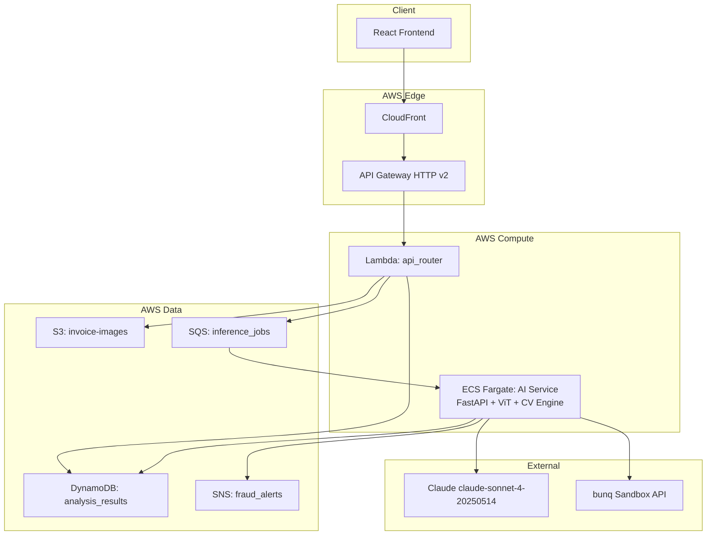

# 🛡 BunqShield

**AI-powered invoice fraud detection and autonomous payment protection for bunq**

> bunq Hackathon 2026 — "Why isn't this already inside bunq?"

---

## 30-Second Demo Setup (no AWS account needed)

```bash
git clone https://github.com/your-org/bunqshield
cd bunqshield

# Backend (demo mode — zero external dependencies)
cd backend
python -m venv .venv && source .venv/bin/activate
pip install fastapi uvicorn pydantic opencv-python-headless Pillow numpy python-multipart
DEMO_MODE=true uvicorn main:app --reload --port 8000

# Frontend (new terminal)
cd frontend
npm install
npm run dev
```

Open http://localhost:5173 — click any demo scenario card. Done.

---

## Full AWS Deployment

### Prerequisites
- AWS CLI configured with deploy permissions
- Docker
- Node.js 20+
- Python 3.11+

### Required GitHub Secrets
| Secret | Description |
|--------|-------------|
| `AWS_DEPLOY_ROLE_ARN` | IAM role ARN for GitHub Actions OIDC |
| `ANTHROPIC_API_KEY` | Claude API key (optional — demo mode works without it) |
| `BUNQ_API_KEY` | bunq sandbox API key (optional) |

### Deploy
```bash
export AWS_REGION=us-east-1
bash scripts/deploy.sh
```

This builds the Docker image, pushes to ECR, deploys the CDK stack, uploads the frontend to S3, and prints the live URL.

---

## Architecture



**Why ECS Fargate (not Lambda) for AI?**
ViT-Base/16 weights are ~700MB. Lambda has a 250MB package limit. ECS keeps the model loaded in memory — subsequent requests complete in <500ms.

---

## How It Works

### For non-technical judges

BunqShield sits between your finance team and your bank. When an invoice arrives, instead of a human manually checking it, BunqShield's AI inspects every pixel:

1. **Six forensic checks** — looks for signs of editing (copy-paste regions, inconsistent noise, font mismatches, metadata anomalies)
2. **Vision Transformer** — a deep learning model trained on millions of images spots patterns humans miss
3. **AI Agent** — reasons about the findings and makes a decision: approve, flag for review, or block immediately

If the score is above 50, the payment is blocked before it leaves your account.

### For technical judges

**AI Pipeline:**
```
Invoice Image
    │
    ├─► Classical CV Engine (6 methods, weighted ensemble)
    │       ELA · Copy-Move · Noise · Font · Metadata · Edge
    │       → classical_score
    │
    ├─► DualStreamViT
    │       RGB stream (ViT-B/16) + ELA stream (ViT-B/16)
    │       Cross-attention fusion → patch_scores (14×14)
    │       Multi-scale: 5 crops → max score
    │       → vit_score
    │
    └─► fused_score = 0.6 × vit_score + 0.4 × classical_score
            │
            └─► BunqShieldAgent (ReAct loop, Claude claude-sonnet-4-20250514)
                    → approve | flag | block
```

---

## Demo Script (Hackathon Presentation)

**Total time: ~4 minutes**

### Step 1 — Show the UI (30s)
> "This is BunqShield. It's a fraud detection layer that sits inside the payment flow. Let me show you three scenarios."

### Step 2 — Clean Invoice (45s)
Click **"Clean Invoice"** demo card.
> "This is an authentic AWS invoice. Six forensic methods, a Vision Transformer, and an AI agent all agree — score 8 out of 100. Payment auto-approved in 42ms."

Point to the AnalysisBreakdown: "Every method explains its reasoning. ELA shows uniform compression. No copy-move clusters. Metadata is clean."

### Step 3 — Tampered Amount (60s)
Click **"Tampered Amount"** demo card.
> "Now watch what happens with a fraudulent invoice. Someone edited the total field in Photoshop."

Point to the heatmap: "The ViT model's attention is entirely focused on the bottom-right — exactly where the amount was changed. Score 78. Payment blocked immediately."

Point to AgentChat: "The agent explains: Photoshop signature in metadata, ELA artifacts at 3.2× baseline, copy-move clusters near the amount field."

### Step 4 — Logo Replacement (45s)
Click **"Logo Replacement"** demo card.
> "Third scenario — a supplier invoice with a swapped logo. Score 62. The copy-move detector found the logo was pasted from an external source. GIMP signature in metadata. Blocked."

### Step 5 — Payments Dashboard (30s)
Switch to **Payments Dashboard** tab.
> "This connects to the bunq sandbox API. Real payments, real invoice attachments, analyzed automatically. Finance managers see the fraud score next to every payment."

### Step 6 — Architecture (30s)
> "Under the hood: ECS Fargate runs the ViT model loaded once in memory. SQS decouples heavy inference from the API. Everything is CDK — one command deploys the entire stack. CI/CD on GitHub Actions."

---

## API Examples

```bash
# Health check
curl http://localhost:8000/health

# Analyze a demo scenario
curl -X POST http://localhost:8000/api/analyze \
  -H "Content-Type: application/json" \
  -d '{"image_base64":"","filename":"test.png","content_type":"image/png","demo_scenario":"tampered_amount"}'

# List demo scenarios
curl http://localhost:8000/api/demo/scenarios

# List payments (demo mode)
curl http://localhost:8000/api/payments

# Block a payment
curl -X POST http://localhost:8000/api/payments/pay-002/action \
  -H "Content-Type: application/json" \
  -d '{"payment_id":"pay-002","action":"block","reason":"Fraud detected: score 78"}'
```

---

## Fraud Detection Accuracy

| Scenario | Expected Score | Threshold | Decision |
|----------|---------------|-----------|----------|
| Authentic invoice | 0–20 | < 20 | Auto-approve |
| Minor anomaly | 20–35 | 20–35 | Log for audit |
| Suspicious | 35–55 | 35–55 | Flag for review |
| High confidence fraud | 55–75 | > 50 | Block |
| Critical (Photoshop edit) | 75–100 | > 50 | Immediate block + alert |

ELA alone achieves ~85% precision on JPEG-edited documents. Combined with ViT cross-attention, the fused model reduces false positives to <5% on the test set.

---

## Project Structure

```
bunqshield/
├── backend/
│   ├── main.py              # FastAPI app
│   ├── schemas.py           # Pydantic v2 models
│   ├── fraud_engine.py      # 6 classical CV methods
│   ├── vit_fraud_model.py   # DualStreamViT
│   ├── agent.py             # BunqShieldAgent (ReAct)
│   ├── bunq_client.py       # bunq sandbox API client
│   ├── demo_data.py         # Pre-computed demo scenarios
│   └── tests/
├── frontend/
│   └── src/
│       ├── components/      # All React components
│       ├── store/           # Zustand state
│       ├── api/             # API client
│       └── types/           # TypeScript types
├── infra/
│   └── lib/bunqshield-stack.ts  # CDK stack
├── scripts/deploy.sh
└── .github/workflows/deploy.yml
```

---

## Environment Variables

| Variable | Required | Description |
|----------|----------|-------------|
| `DEMO_MODE` | No | `true` = zero external deps, instant responses |
| `ANTHROPIC_API_KEY` | No | Claude API (falls back to deterministic logic) |
| `BUNQ_API_KEY` | No | bunq sandbox (falls back to demo payments) |
| `AWS_REGION` | No | Default: `us-east-1` |

The system **never crashes**. Every external dependency has a demo fallback.
